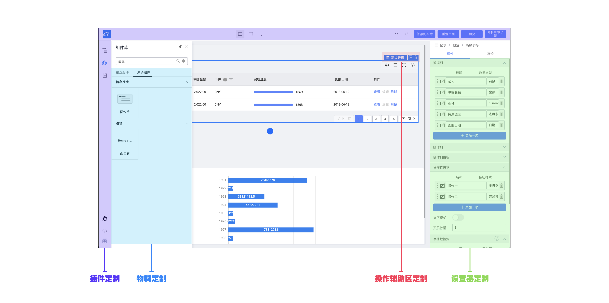

# 阿里低代码引擎调研文档

## 什么是低代码引擎

### &nbsp;&nbsp;&nbsp;&nbsp;&nbsp; 低代码引擎是一款为低代码平台开发者提供的，具备强大扩展能力的低代码研发框架。

### &nbsp;&nbsp;&nbsp;&nbsp;&nbsp; 低代码引擎由阿里巴巴前端委员会、钉钉宜搭联合出品。使用者只需要基于低代码引擎便可以快速定制符合自己业务需求的**低代码平台**。同时，低代码引擎还在标准低代码设计器的基础上提供了简单易用的定制扩展能力，能够满足业务独特的功能需要。

### &nbsp;&nbsp;&nbsp;&nbsp;&nbsp;使用者只需要基于低代码引擎便可以快速定制符合自己业务需求的低代码平台。同时，低代码引擎还在标准低代码设计器的基础上提供了简单易用的定制扩展能力，能够满足业务独特的功能需要。简单地说，原本需要维护多个平台的代码，开发需要懂得多个框架，维护成本高。现在只需要拖拽组件，再绑定数据，就可以完成一套服务，减少了人力和维护成本。 [官网地址](https://lowcode-engine.cn/index)

## 阿里低代码引擎功能介绍

### 1、 低代码设计器

下图是阿里的低代码平台的设计器，用来设计前端需要展示的页面。

设计器承载着低代码平台的核心功能，包括入料、编排、组件配置、画布渲染等等。由于其功能多，打磨精细难，也是低代码平台建设最耗时的地方。

### 2、定制扩展能力

设计器也具有扩展能力，可以不用看它的源码、不用关心其实现，使用 API、插件等方式快速完成能力的开发。

### 3、应用

阿里的低代码引擎之前被应用在钉钉宜搭上，帮助开发者快速完成应用。[宜搭官网](https://www.aliwork.com/)

## 根据官网定义，我们可以获得几个信息：

1、 阿里的这款低代码引擎核心是设计器。

2、阿里低代码引擎并不适用所有人，只对专业开发者提供。

3、低代码引擎是一种低代码研发框架，是为了开发 “低代码平台” 而存在的

## 总结

&nbsp;&nbsp;&nbsp;&nbsp;&nbsp;&nbsp;事实上 LowCodeEngine 是一款基于 react 的组件化框架，把原本需要编码插入的实现方式，转变成了基于 web 界面的参数化生成，本质上还是一套 webUI 交互的 js 代码生成器，用这个引擎可以拖拖拽拽生成一套基于 react 框架的页面，同时可以实现页面绑定，图像化显示，事件触发等等。

&nbsp;&nbsp;&nbsp;&nbsp;&nbsp;&nbsp;低代码引擎是属于前端的 SDK，是一款面向前端开发人员的技术产品，并不是为了开发应用程序，而是在此基础上快速定制符合自己业务需求的低代码平台。
