## 需求整理

> 场景 1：游客想知道当地有那些景区

     需求描述：通过景区列表从不维度展示当地景区信息

ui 设计:

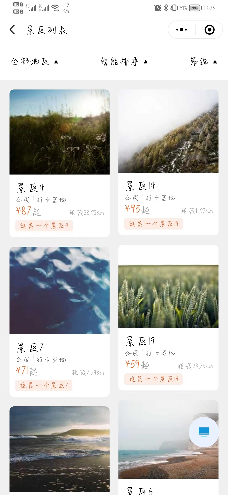

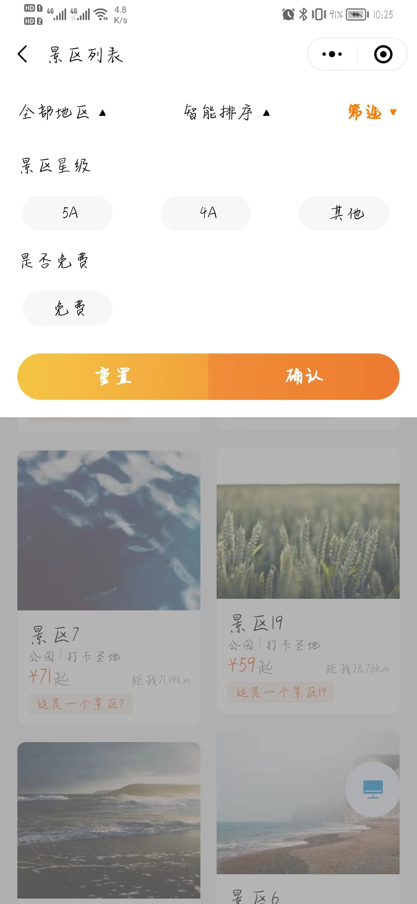

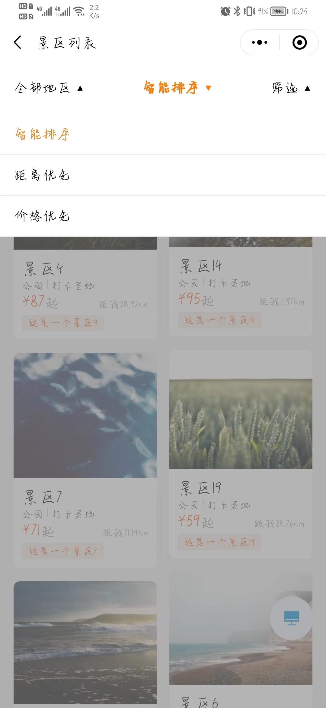

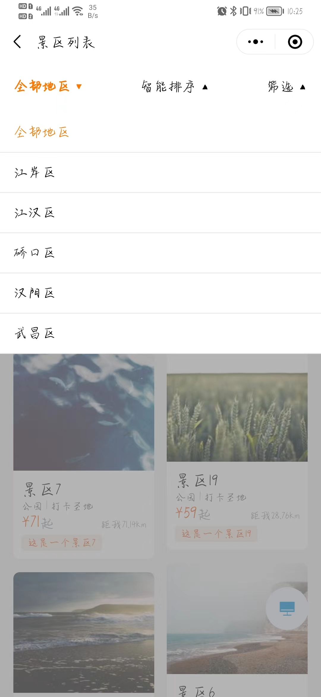

设计原由：

- 顶部通过下拉菜单进行景区列表的筛选
- 每个下拉菜单根据不同的维度筛选景区
- 通过瀑布流的形式展示景区信息，吸引游客，提升视觉体验
- 每个景区的卡片包含：景区名称、票价、类型、距离

> 场景 2：管理员希望在系统中可以预览本地的数据而且进行修改

     需求描述：以 excel 文件的形式将本地数据导入系统，进行预览和修改
     1. 用户可以实现导入Excel文件的形式导入数据
     2. 用户可以查看导入的数据
     3. 用户可以对预览的数据进行修改，包括添加、删除、编辑等操作。

ui 设计：

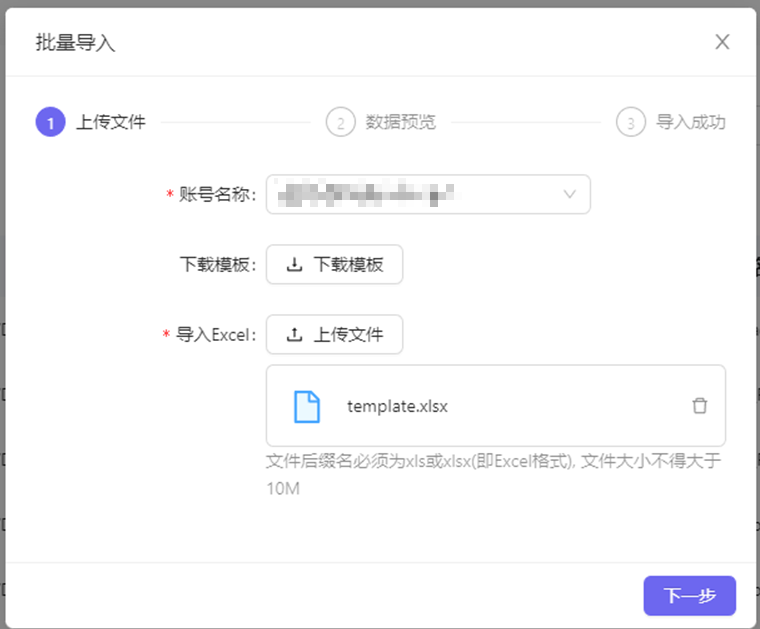

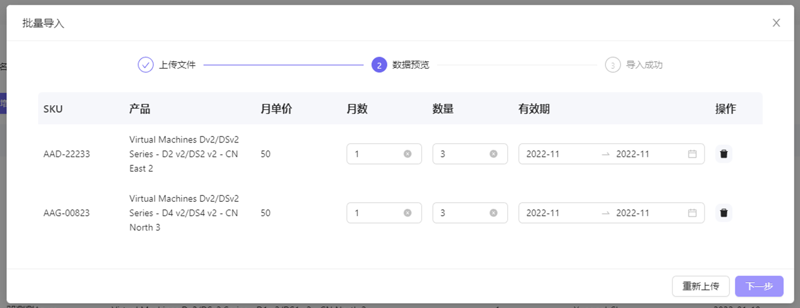

设计原由：

- 在展示数据的表格上方有一个导入按钮，点击打开弹窗
- 导入功能设计为三个步骤
- 第一个步骤导入文件，填写名称
- 第二个步骤查看并修改导入文件内容
- 第三个确认导入

> 场景 3：一个云平台有很多的账号

需求描述：通过账号管理功能实现对所有账户统一管理

ui 设计：

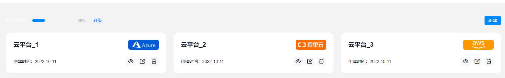

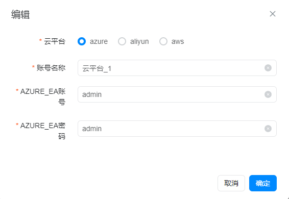

设计原由：

- 顶部左侧统计账号数量，右侧摆放新建按钮，点击新建按钮弹出模态框，在表单里添加数据，实现新增账号的功能
- 通过一个卡片管理一个账号信息，展示账号名称，创建时间等信息
- 卡片底部右侧摆放查看、编辑、删除 icon，对应其操作
- 点击 icon 弹出模态框账号信息的查看，编辑，删除操作

> 场景 4：工业设备多，每个设备运行时间不清楚

需求描述：通过大屏实时对工业设备进行监控，显示设备的运行时间
ui 设计：

> 场景 5：用户某个平台消费达到一定金额后对用户进行回馈

需求描述：消费可以积攒积分，积分达到一定额度都提醒用户领取积分，兑换商品

ui 设计

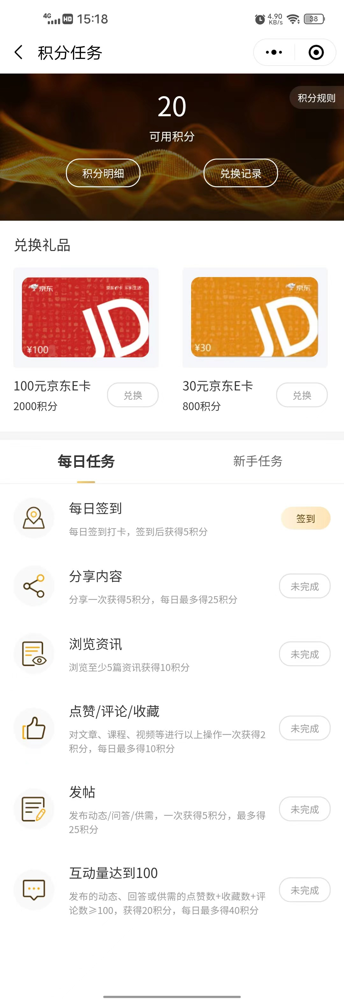

设计原由

- 头部显示可用积分，积分明细，兑换记录，向用户展示积分信息
- 中间采用颜色醒目的卡片展示积分可兑换的礼品，吸引用户
- 每日任务和新手列表展示可以领取积分的渠道和任务

> 场景 6：用户想知道商城中有那些种类商品

需求描述：默认商品 二级分类，显示分类缩略图、名称，点击进入该分类对应的商品列表

ui 设计：

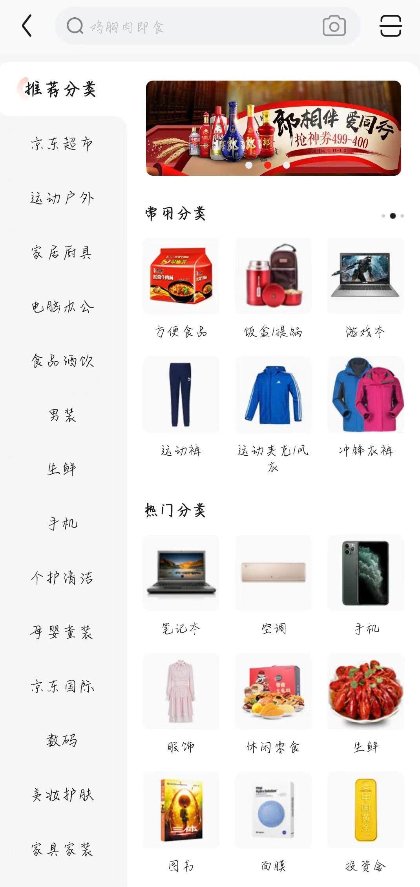

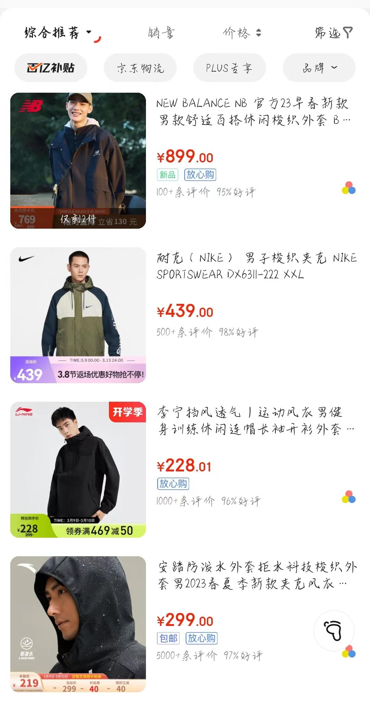
设计原由
-
