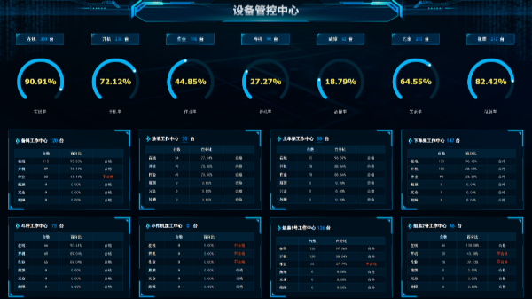

## 需求整理

> 场景 1：游客想知道当地有那些景区

     需求描述：通过景区列表从不维度展示当地景区信息

ui 设计:

设计原由：

- 顶部通过下拉菜单进行景区列表的筛选
- 每个下拉菜单根据不同的维度筛选景区
- 通过瀑布流的形式展示景区信息，吸引游客，提升视觉体验
- 每个景区的卡片包含：景区名称、票价、类型、距离

> 场景 2：管理员希望在系统中可以预览本地的数据而且进行修改

     需求描述：以 excel 文件的形式将本地数据导入系统，进行预览和修改
     1. 用户可以实现导入Excel文件的形式导入数据
     2. 用户可以查看导入的数据
     3. 用户可以对预览的数据进行修改，包括添加、删除、编辑等操作。

ui 设计：

设计原由：

- 在展示数据的表格上方有一个导入按钮，点击打开弹窗
- 导入功能设计为三个步骤
- 第一个步骤导入文件，填写名称
- 第二个步骤查看并修改导入文件内容
- 第三个确认导入

> 场景 3：一个云平台有很多的账号

     需求描述：通过账号管理功能实现对所有账户统一管理

ui 设计：

设计原由：

- 顶部左侧统计账号数量，右侧摆放新建按钮，点击新建按钮弹出模态框，在表单里添加数据，实现新增账号的功能
- 通过一个卡片管理一个账号信息，展示账号名称，创建时间等信息
- 卡片底部右侧摆放查看、编辑、删除 icon，对应其操作
- 点击 icon 弹出模态框账号信息的查看，编辑，删除操作

> 场景 4：工业设备多，每个设备运行时间不清楚

     需求描述：

     ● 根据制造设备监控分析需求，与对应数据源建立连接，加工设计数据集。

     ● 设计可视化大屏看板，展示信息，调整布局，保存预览

     ● 实时监控生产状态，各车间的生产调度只需在办公室通过电脑即可进行指挥调度，真正实现了集中调度，统一指挥。

ui 设计：

> 场景 5：用户某个平台消费达到一定金额后对用户进行回馈

     需求描述：

     ● 设置积分兑换禁止项目。商家需要设定哪些商品可以通过积分兑换，哪些不可以，以确保商家的商品可以推广。

     ● 积分兑换比例。商家需要根据实际情况设置积分兑换比例，以确保积分的价值与现金的购买力相当。

     ● 积分有效期。商家需要设定积分的有效期，以鼓励用户尽早使用积分。

     ● 积分获取途径。商家需要明确用户可以通过哪些途径获取积分，比如完成任务、购买商品等。

ui 设计

设计原由

- 头部显示可用积分，积分明细，兑换记录，向用户展示积分信息
- 中间采用颜色醒目的卡片展示积分可兑换的礼品，吸引用户
- 每日任务和新手列表展示可以领取积分的渠道和任务

> 场景 6：用户想知道商城中有那些种类商品

     需求描述：默认商品 二级分类，显示分类缩略图、名称，点击进入该分类对应的商品列表

ui 设计：

设计原由

> 场景 7：用户购物车下单

     需求描述：

     ● 用户在商品详细页点击加入购物车，提交商品SKU编号和购买数量，添加到购物车

      ● 电商平台包含多个商家，用户在添加商品至购物车时，就应该按照不同的商家添加。这样一个购物车包含多个商家，一个商家包含多个商品。

       ● 一个用户对应一个购物车，一个购物车包含多个商家，一个用户可以购买一个商家多个商品。

       ● 商品可以在登录状态下添加到购物车（登录购物车/在线购物车）

ui 设计：

设计原由

- 头部设计可选则收货地址，编辑删除功能
- 中间采用列表形式展示购物车内数据
- 底部放置全选功能，和显示选中数量、总体金额和一键结算功能方便用户

> 场景 8：转盘抽奖

     需求描述： 实现一个大转盘活动，用户有三次抽奖机会，每次抽奖后给用户返回中奖结果。中奖概率和奖品在活动前由产品经理给出：

     ● 一等奖——中奖概率为 1 %，1000元红包

     ●  二等奖——中奖概率为 5 %，100元红包

     ● 三等奖——中奖概率为 10 %，10 元红包

     ● 其余为未中奖

ui 设计：

> 场景 9：下单流程

     需求描述

     1、商品信息和金额信息展示

       在订单确认页面，需要展示商品的信息和金额信息。商品信息包括图片、标题、规格、价格、数量，如果是平台型商城，还会展示商家店铺名称。金额信息一般包含商品金额、运费金额、优惠金额、积分抵扣金额、活动减免金额、应付金额。[0]

     2、功能操作

       在订单确认页面，用户可以进行一些信息补充或设置操作。这些功能包括：

       ● 添加地址（含收货地址和代发地址）

       ● 添加发票

       ● 编辑留言

       ● 使用优惠信息（含优惠券和积分抵扣）[0]

ui 设计

