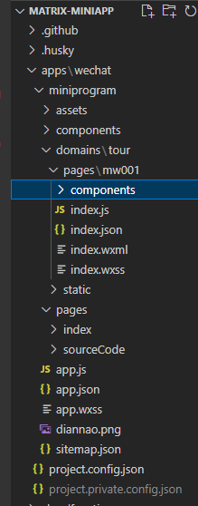

# 开源贡献流程

## monorepo 目录结构

<!--  -->

- 在 apps 中我们用技术栈来划分不同的工程，暂且只有 wechat（微信小程序） 一个工程，后面会补充 vue 及 react 的工程。
- 在 wechat 下，再次按照技术栈划分不同的工程，miniprogram 是原生小程序的工程，将来补充 uniapp 的工程。
- components 中存放一些整个工程的公共组件，assets 存放静态资源
- domains 作为管理工程下所有子包的主包。
- domains 下用不同的行业划分子包，tour（旅游业）就是一个子包。
- mw001（景区列表）是子包 tour 中的一个业务场景
